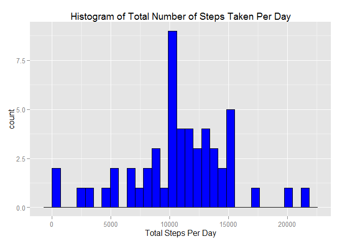
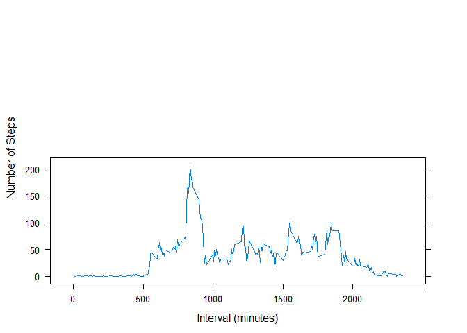
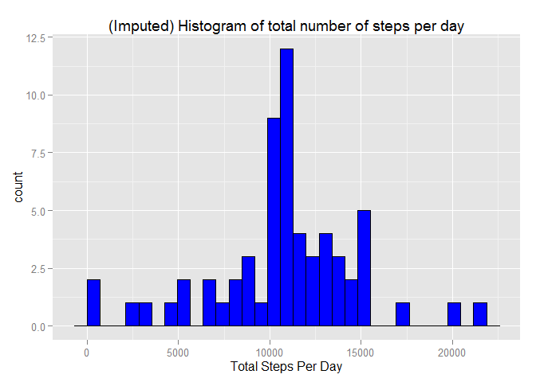
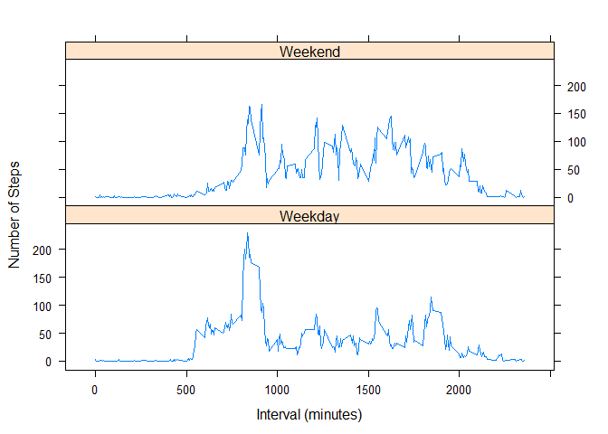

# Reproducible Research: Peer Assessment 1


## Loading and preprocessing the data
1. Load the data (i.e. read.csv())
2. Process/transform the data (if necessary) into a format suitable for your analysis

```r
library(knitr)
library(ggplot2)
file<-"./activity.csv"
MyData<-read.csv(file, header = TRUE, sep= ",")
```


## What is mean total number of steps taken per day?
3. For this part of the assignment, you can ignore the missing values in the dataset.


```r
complete_data<-na.omit(MyData) #data with NA's removed
```


4. Calculate the total number of steps taken per day

```r
dailysteps<-aggregate(steps ~ date, complete_data, sum)
dailysteps
```

```
##          date steps
## 1  2012-10-02   126
## 2  2012-10-03 11352
## 3  2012-10-04 12116
## 4  2012-10-05 13294
## 5  2012-10-06 15420
## 6  2012-10-07 11015
## 7  2012-10-09 12811
## 8  2012-10-10  9900
## 9  2012-10-11 10304
## 10 2012-10-12 17382
## 11 2012-10-13 12426
## 12 2012-10-14 15098
## 13 2012-10-15 10139
## 14 2012-10-16 15084
## 15 2012-10-17 13452
## 16 2012-10-18 10056
## 17 2012-10-19 11829
## 18 2012-10-20 10395
## 19 2012-10-21  8821
## 20 2012-10-22 13460
## 21 2012-10-23  8918
## 22 2012-10-24  8355
## 23 2012-10-25  2492
## 24 2012-10-26  6778
## 25 2012-10-27 10119
## 26 2012-10-28 11458
## 27 2012-10-29  5018
## 28 2012-10-30  9819
## 29 2012-10-31 15414
## 30 2012-11-02 10600
## 31 2012-11-03 10571
## 32 2012-11-05 10439
## 33 2012-11-06  8334
## 34 2012-11-07 12883
## 35 2012-11-08  3219
## 36 2012-11-11 12608
## 37 2012-11-12 10765
## 38 2012-11-13  7336
## 39 2012-11-15    41
## 40 2012-11-16  5441
## 41 2012-11-17 14339
## 42 2012-11-18 15110
## 43 2012-11-19  8841
## 44 2012-11-20  4472
## 45 2012-11-21 12787
## 46 2012-11-22 20427
## 47 2012-11-23 21194
## 48 2012-11-24 14478
## 49 2012-11-25 11834
## 50 2012-11-26 11162
## 51 2012-11-27 13646
## 52 2012-11-28 10183
## 53 2012-11-29  7047
```

5. If you do not understand the difference between a histogram and a barplot, research the difference between them. Make a histogram of the total number of steps taken each day


```r
ggplot(dailysteps, aes(x=steps)) + geom_histogram(fill="blue", color="black")+ggtitle("Histogram of Total Number of Steps Taken Per Day") +xlab("Total Steps Per Day")
```

 


6. Calculate and report the mean and median of the total number of steps taken per day


```r
dailyaverage<-aggregate(steps ~ date, complete_data, mean)
medianofstepsbyday <- median(dailysteps$steps)
dailyaverage
```

```
##          date      steps
## 1  2012-10-02  0.4375000
## 2  2012-10-03 39.4166667
## 3  2012-10-04 42.0694444
## 4  2012-10-05 46.1597222
## 5  2012-10-06 53.5416667
## 6  2012-10-07 38.2465278
## 7  2012-10-09 44.4826389
## 8  2012-10-10 34.3750000
## 9  2012-10-11 35.7777778
## 10 2012-10-12 60.3541667
## 11 2012-10-13 43.1458333
## 12 2012-10-14 52.4236111
## 13 2012-10-15 35.2048611
## 14 2012-10-16 52.3750000
## 15 2012-10-17 46.7083333
## 16 2012-10-18 34.9166667
## 17 2012-10-19 41.0729167
## 18 2012-10-20 36.0937500
## 19 2012-10-21 30.6284722
## 20 2012-10-22 46.7361111
## 21 2012-10-23 30.9652778
## 22 2012-10-24 29.0104167
## 23 2012-10-25  8.6527778
## 24 2012-10-26 23.5347222
## 25 2012-10-27 35.1354167
## 26 2012-10-28 39.7847222
## 27 2012-10-29 17.4236111
## 28 2012-10-30 34.0937500
## 29 2012-10-31 53.5208333
## 30 2012-11-02 36.8055556
## 31 2012-11-03 36.7048611
## 32 2012-11-05 36.2465278
## 33 2012-11-06 28.9375000
## 34 2012-11-07 44.7326389
## 35 2012-11-08 11.1770833
## 36 2012-11-11 43.7777778
## 37 2012-11-12 37.3784722
## 38 2012-11-13 25.4722222
## 39 2012-11-15  0.1423611
## 40 2012-11-16 18.8923611
## 41 2012-11-17 49.7881944
## 42 2012-11-18 52.4652778
## 43 2012-11-19 30.6979167
## 44 2012-11-20 15.5277778
## 45 2012-11-21 44.3993056
## 46 2012-11-22 70.9270833
## 47 2012-11-23 73.5902778
## 48 2012-11-24 50.2708333
## 49 2012-11-25 41.0902778
## 50 2012-11-26 38.7569444
## 51 2012-11-27 47.3819444
## 52 2012-11-28 35.3576389
## 53 2012-11-29 24.4687500
```

```r
medianofstepsbyday
```

```
## [1] 10765
```


## What is the average daily activity pattern?
7. Make a time series plot (i.e. type = "l") of the 5-minute interval (x-axis) and the average number of steps taken, averaged across all days (y-axis)
    a) Split data by intervals.
    b) Calculate average of steps in each 5 minutes interval.
    c) Plot 5-minute interval (x-axis) and the average number of steps taken,     averaged across all days (y-axis).
   

```r
library("lattice")

dailyInterval<-aggregate(steps ~ interval, complete_data, mean)


xyplot(
  type="l",
  data=dailyInterval,
  steps~interval  ,
  xlab="Interval (minutes)",
  ylab="Number of Steps",
  layout=c(1,2))
```

 


8. Which 5-minute interval, on average across all the days in the dataset, contains the maximum number of steps?

```r
with(dailyInterval,interval[which.max(steps)])
```

```
## [1] 835
```


## Imputing missing values
Note that there are a number of days/intervals where there are missing values (coded as NA). The presence of missing days may introduce bias into some calculations or summaries of the data.


9. Calculate and report the total number of missing values in the dataset (i.e. the total number of rows with NAs)


```r
dataSet_NA<- sum(!complete.cases(MyData))
dataSet_NA
```

```
## [1] 2304
```


10. Devise a strategy for filling in all of the missing values in the dataset. The strategy does not need to be sophisticated. For example, you could use the mean/median for that day, or the mean for that 5-minute interval, etc.

11. Create a new dataset that is equal to the original dataset but with the missing data filled in.

12. Make a histogram of the total number of steps taken each day and Calculate and report the mean and median total number of steps taken per day. Do these values differ from the estimates from the first part of the assignment? What is the impact of imputing missing data on the estimates of the total daily number of steps?


```r
# perform the imputation
datafull<-MyData
nas<-is.na(datafull$steps)
avg_interval<-tapply (datafull$steps, datafull$interval, mean, na.rm=TRUE, simplify=TRUE) #return mean of steps by interval while ignoring Nas as a vector
datafull$steps[nas]<-avg_interval[as.character(datafull$interval[nas])]
#sum(is.na(datafull$steps)) #to check for no of Nas in new dataset


# aggregate steps as per date to get total number of steps in a day
date_steps_imputed <- aggregate(steps ~ date, datafull, sum)


# create histogram of total number of steps in a day
ggplot(date_steps_imputed, aes(x=steps)) + geom_histogram(fill="blue", color="black")+ggtitle("(Imputed) Histogram of total number of steps per day") +xlab("Total Steps Per Day")
```

 

```r
# get mean and median of total number of steps per day
mean(date_steps_imputed$steps)
```

```
## [1] 10766.19
```

```r
median(date_steps_imputed$steps)
```

```
## [1] 10766.19
```

```r
# get mean and median of total number of steps per day for data with NA's removed
mean(dailysteps$steps)
```

```
## [1] 10766.19
```

```r
median(dailysteps$steps)
```

```
## [1] 10765
```


## Are there differences in activity patterns between weekdays and weekends?
For this part the weekdays() function may be of some help here. Use the dataset with the filled-in missing values for this part.

13. Create a new factor variable in the dataset with two levels - "weekday" and "weekend" indicating whether a given date is a weekday or weekend day.

```r
df<-datafull
# convert date from string to Date class
df$date <- as.Date(df$date, "%Y-%m-%d")

# add a new column indicating day of the week 
df$day <- weekdays(df$date)

#compare Day with  a list ("SUNDAY", "SATURDAY")
df$DayType<-factor(df$day) #copy a new column to factor 
levels(df$DayType)<- list(
  Weekday=c("Monday", "Tuesday", "Wednesday", "Thursday","Friday"),
  Weekend = c("Saturday", "Sunday") #rename DayType to weekday or weekend
  )
#df
```


14. Make a panel plot containing a time series plot (i.e. type = "l") of the 5-minute interval (x-axis) and the average number of steps taken, averaged across all weekday days or weekend days (y-axis).

```r
dayTypeInterval<-aggregate(steps~interval+ DayType , data=df,FUN= mean)
dayTypeInterval
```

```
##     interval DayType        steps
## 1          0 Weekday 2.251153e+00
## 2          5 Weekday 4.452830e-01
## 3         10 Weekday 1.731656e-01
## 4         15 Weekday 1.979036e-01
## 5         20 Weekday 9.895178e-02
## 6         25 Weekday 1.590356e+00
## 7         30 Weekday 6.926625e-01
## 8         35 Weekday 1.137945e+00
## 9         40 Weekday 0.000000e+00
## 10        45 Weekday 1.796226e+00
## 11        50 Weekday 3.958071e-01
## 12        55 Weekday 1.761006e-02
## 13       100 Weekday 4.205451e-01
## 14       105 Weekday 9.056604e-02
## 15       110 Weekday 1.979036e-01
## 16       115 Weekday 4.452830e-01
## 17       120 Weekday 0.000000e+00
## 18       125 Weekday 1.459539e+00
## 19       130 Weekday 2.221803e+00
## 20       135 Weekday 2.264151e-02
## 21       140 Weekday 2.226415e-01
## 22       145 Weekday 2.503145e-01
## 23       150 Weekday 3.463312e-01
## 24       155 Weekday 0.000000e+00
## 25       200 Weekday 0.000000e+00
## 26       205 Weekday 0.000000e+00
## 27       210 Weekday 1.395388e+00
## 28       215 Weekday 0.000000e+00
## 29       220 Weekday 0.000000e+00
## 30       225 Weekday 1.731656e-01
## 31       230 Weekday 0.000000e+00
## 32       235 Weekday 2.968553e-01
## 33       240 Weekday 0.000000e+00
## 34       245 Weekday 0.000000e+00
## 35       250 Weekday 2.028512e+00
## 36       255 Weekday 1.236897e+00
## 37       300 Weekday 0.000000e+00
## 38       305 Weekday 0.000000e+00
## 39       310 Weekday 0.000000e+00
## 40       315 Weekday 0.000000e+00
## 41       320 Weekday 2.767296e-02
## 42       325 Weekday 8.163522e-01
## 43       330 Weekday 1.238574e+00
## 44       335 Weekday 5.224319e-01
## 45       340 Weekday 4.209644e-01
## 46       345 Weekday 9.895178e-02
## 47       350 Weekday 0.000000e+00
## 48       355 Weekday 0.000000e+00
## 49       400 Weekday 2.696017e-01
## 50       405 Weekday 1.236897e+00
## 51       410 Weekday 2.231027e+00
## 52       415 Weekday 0.000000e+00
## 53       420 Weekday 4.452830e-01
## 54       425 Weekday 4.779874e-02
## 55       430 Weekday 3.370650e+00
## 56       435 Weekday 2.213836e-01
## 57       440 Weekday 3.776520e+00
## 58       445 Weekday 8.884696e-01
## 59       450 Weekday 2.348428e+00
## 60       455 Weekday 7.262055e-01
## 61       500 Weekday 0.000000e+00
## 62       505 Weekday 2.053249e+00
## 63       510 Weekday 3.933333e+00
## 64       515 Weekday 2.188260e+00
## 65       520 Weekday 4.220545e+00
## 66       525 Weekday 2.706080e+00
## 67       530 Weekday 2.745912e+00
## 68       535 Weekday 7.940881e+00
## 69       540 Weekday 2.040252e+01
## 70       545 Weekday 2.364528e+01
## 71       550 Weekday 5.034927e+01
## 72       555 Weekday 5.626541e+01
## 73       600 Weekday 4.128763e+01
## 74       605 Weekday 6.459078e+01
## 75       610 Weekday 7.008092e+01
## 76       615 Weekday 7.714927e+01
## 77       620 Weekday 6.392830e+01
## 78       625 Weekday 6.003229e+01
## 79       630 Weekday 6.644235e+01
## 80       635 Weekday 4.797862e+01
## 81       640 Weekday 5.566918e+01
## 82       645 Weekday 5.486709e+01
## 83       650 Weekday 4.704780e+01
## 84       655 Weekday 6.042725e+01
## 85       700 Weekday 5.059706e+01
## 86       705 Weekday 5.082809e+01
## 87       710 Weekday 6.202348e+01
## 88       715 Weekday 6.933459e+01
## 89       720 Weekday 6.310105e+01
## 90       725 Weekday 5.910860e+01
## 91       730 Weekday 6.622390e+01
## 92       735 Weekday 5.435388e+01
## 93       740 Weekday 6.272411e+01
## 94       745 Weekday 8.338407e+01
## 95       750 Weekday 6.773543e+01
## 96       755 Weekday 6.657568e+01
## 97       800 Weekday 8.271698e+01
## 98       805 Weekday 7.196101e+01
## 99       810 Weekday 1.440134e+02
## 100      815 Weekday 1.819816e+02
## 101      820 Weekday 2.005757e+02
## 102      825 Weekday 1.836084e+02
## 103      830 Weekday 1.988847e+02
## 104      835 Weekday 2.303782e+02
## 105      840 Weekday 2.189010e+02
## 106      845 Weekday 1.856532e+02
## 107      850 Weekday 1.912306e+02
## 108      855 Weekday 1.770914e+02
## 109      900 Weekday 1.676604e+02
## 110      905 Weekday 1.257828e+02
## 111      910 Weekday 9.394843e+01
## 112      915 Weekday 8.730398e+01
## 113      920 Weekday 1.035400e+02
## 114      925 Weekday 9.246164e+01
## 115      930 Weekday 5.851656e+01
## 116      935 Weekday 3.585241e+01
## 117      940 Weekday 2.746122e+01
## 118      945 Weekday 4.085618e+01
## 119      950 Weekday 3.913082e+01
## 120      955 Weekday 1.762977e+01
## 121     1000 Weekday 3.787547e+01
## 122     1005 Weekday 1.821971e+01
## 123     1010 Weekday 3.907757e+01
## 124     1015 Weekday 4.782138e+01
## 125     1020 Weekday 3.034549e+01
## 126     1025 Weekday 3.515010e+01
## 127     1030 Weekday 3.312662e+01
## 128     1035 Weekday 2.425535e+01
## 129     1040 Weekday 2.351530e+01
## 130     1045 Weekday 2.591195e+01
## 131     1050 Weekday 2.203480e+01
## 132     1055 Weekday 2.325912e+01
## 133     1100 Weekday 2.169224e+01
## 134     1105 Weekday 2.509057e+01
## 135     1110 Weekday 1.168721e+01
## 136     1115 Weekday 1.627296e+01
## 137     1120 Weekday 2.418365e+01
## 138     1125 Weekday 2.372956e+01
## 139     1130 Weekday 3.276897e+01
## 140     1135 Weekday 5.019748e+01
## 141     1140 Weekday 4.456059e+01
## 142     1145 Weekday 4.792495e+01
## 143     1150 Weekday 5.011614e+01
## 144     1155 Weekday 5.613627e+01
## 145     1200 Weekday 5.571572e+01
## 146     1205 Weekday 7.284864e+01
## 147     1210 Weekday 8.364654e+01
## 148     1215 Weekday 7.528092e+01
## 149     1220 Weekday 4.871950e+01
## 150     1225 Weekday 4.682264e+01
## 151     1230 Weekday 6.257400e+01
## 152     1235 Weekday 3.074423e+01
## 153     1240 Weekday 2.198155e+01
## 154     1245 Weekday 2.932034e+01
## 155     1250 Weekday 3.278532e+01
## 156     1255 Weekday 5.659329e+01
## 157     1300 Weekday 2.460084e+01
## 158     1305 Weekday 2.574046e+01
## 159     1310 Weekday 2.456855e+01
## 160     1315 Weekday 1.564193e+01
## 161     1320 Weekday 3.563270e+01
## 162     1325 Weekday 4.485786e+01
## 163     1330 Weekday 3.176730e+01
## 164     1335 Weekday 2.330650e+01
## 165     1340 Weekday 2.523941e+01
## 166     1345 Weekday 4.018407e+01
## 167     1350 Weekday 2.557610e+01
## 168     1355 Weekday 3.633040e+01
## 169     1400 Weekday 4.692285e+01
## 170     1405 Weekday 3.955052e+01
## 171     1410 Weekday 3.212243e+01
## 172     1415 Weekday 4.504864e+01
## 173     1420 Weekday 2.748512e+01
## 174     1425 Weekday 3.076184e+01
## 175     1430 Weekday 3.149099e+01
## 176     1435 Weekday 1.451237e+01
## 177     1440 Weekday 1.154843e+01
## 178     1445 Weekday 2.198784e+01
## 179     1450 Weekday 4.186080e+01
## 180     1455 Weekday 3.828092e+01
## 181     1500 Weekday 3.086918e+01
## 182     1505 Weekday 3.505451e+01
## 183     1510 Weekday 2.995430e+01
## 184     1515 Weekday 3.191321e+01
## 185     1520 Weekday 3.986164e+01
## 186     1525 Weekday 3.734507e+01
## 187     1530 Weekday 4.212872e+01
## 188     1535 Weekday 5.093166e+01
## 189     1540 Weekday 9.056520e+01
## 190     1545 Weekday 9.586583e+01
## 191     1550 Weekday 9.394843e+01
## 192     1555 Weekday 7.030608e+01
## 193     1600 Weekday 4.688428e+01
## 194     1605 Weekday 4.519539e+01
## 195     1610 Weekday 5.660629e+01
## 196     1615 Weekday 3.613375e+01
## 197     1620 Weekday 2.680964e+01
## 198     1625 Weekday 2.952537e+01
## 199     1630 Weekday 2.251572e+01
## 200     1635 Weekday 2.183103e+01
## 201     1640 Weekday 2.586583e+01
## 202     1645 Weekday 3.199371e+01
## 203     1650 Weekday 2.762767e+01
## 204     1655 Weekday 3.242390e+01
## 205     1700 Weekday 2.357191e+01
## 206     1705 Weekday 4.495136e+01
## 207     1710 Weekday 3.418449e+01
## 208     1715 Weekday 4.807463e+01
## 209     1720 Weekday 6.011782e+01
## 210     1725 Weekday 7.237023e+01
## 211     1730 Weekday 5.614801e+01
## 212     1735 Weekday 6.582138e+01
## 213     1740 Weekday 8.287925e+01
## 214     1745 Weekday 5.933459e+01
## 215     1750 Weekday 3.450314e+01
## 216     1755 Weekday 3.759371e+01
## 217     1800 Weekday 2.664612e+01
## 218     1805 Weekday 4.662474e+01
## 219     1810 Weekday 6.722642e+01
## 220     1815 Weekday 8.264277e+01
## 221     1820 Weekday 6.139078e+01
## 222     1825 Weekday 7.345870e+01
## 223     1830 Weekday 7.922642e+01
## 224     1835 Weekday 8.149937e+01
## 225     1840 Weekday 9.171195e+01
## 226     1845 Weekday 1.154604e+02
## 227     1850 Weekday 1.013002e+02
## 228     1855 Weekday 9.059161e+01
## 229     1900 Weekday 8.756017e+01
## 230     1905 Weekday 7.722180e+01
## 231     1910 Weekday 6.238281e+01
## 232     1915 Weekday 5.438113e+01
## 233     1920 Weekday 3.788721e+01
## 234     1925 Weekday 2.056226e+01
## 235     1930 Weekday 2.909727e+01
## 236     1935 Weekday 4.598029e+01
## 237     1940 Weekday 3.004990e+01
## 238     1945 Weekday 1.858407e+01
## 239     1950 Weekday 4.426583e+01
## 240     1955 Weekday 2.729266e+01
## 241     2000 Weekday 1.339413e+01
## 242     2005 Weekday 5.558071e+00
## 243     2010 Weekday 6.823061e+00
## 244     2015 Weekday 1.411195e+01
## 245     2020 Weekday 8.708176e+00
## 246     2025 Weekday 5.711530e+00
## 247     2030 Weekday 9.773585e+00
## 248     2035 Weekday 7.156394e+00
## 249     2040 Weekday 8.961845e+00
## 250     2045 Weekday 1.310943e+01
## 251     2050 Weekday 2.597358e+01
## 252     2055 Weekday 1.730901e+01
## 253     2100 Weekday 1.137023e+01
## 254     2105 Weekday 1.889686e+01
## 255     2110 Weekday 2.850482e+01
## 256     2115 Weekday 1.894382e+01
## 257     2120 Weekday 1.428260e+01
## 258     2125 Weekday 8.046960e+00
## 259     2130 Weekday 1.279916e+01
## 260     2135 Weekday 1.650692e+01
## 261     2140 Weekday 7.135010e+00
## 262     2145 Weekday 7.594549e+00
## 263     2150 Weekday 8.262055e+00
## 264     2155 Weekday 3.438574e+00
## 265     2200 Weekday 1.527044e+00
## 266     2205 Weekday 4.423899e+00
## 267     2210 Weekday 6.308176e+00
## 268     2215 Weekday 1.115681e+01
## 269     2220 Weekday 9.276730e+00
## 270     2225 Weekday 1.084864e+01
## 271     2230 Weekday 1.278952e+01
## 272     2235 Weekday 2.894340e+00
## 273     2240 Weekday 4.276730e-02
## 274     2245 Weekday 1.484277e-01
## 275     2250 Weekday 1.902725e+00
## 276     2255 Weekday 2.013836e+00
## 277     2300 Weekday 3.551363e+00
## 278     2305 Weekday 3.735430e+00
## 279     2310 Weekday 0.000000e+00
## 280     2315 Weekday 1.088470e+00
## 281     2320 Weekday 1.261635e+00
## 282     2325 Weekday 1.877987e+00
## 283     2330 Weekday 3.036059e+00
## 284     2335 Weekday 2.248637e+00
## 285     2340 Weekday 2.240252e+00
## 286     2345 Weekday 2.633124e-01
## 287     2350 Weekday 2.968553e-01
## 288     2355 Weekday 1.410063e+00
## 289        0 Weekend 2.146226e-01
## 290        5 Weekend 4.245283e-02
## 291       10 Weekend 1.650943e-02
## 292       15 Weekend 1.886792e-02
## 293       20 Weekend 9.433962e-03
## 294       25 Weekend 3.511792e+00
## 295       30 Weekend 6.603774e-02
## 296       35 Weekend 1.084906e-01
## 297       40 Weekend 0.000000e+00
## 298       45 Weekend 5.589623e-01
## 299       50 Weekend 3.773585e-02
## 300       55 Weekend 4.540094e-01
## 301      100 Weekend 4.009434e-02
## 302      105 Weekend 2.334906e+00
## 303      110 Weekend 1.886792e-02
## 304      115 Weekend 4.245283e-02
## 305      120 Weekend 0.000000e+00
## 306      125 Weekend 1.391509e-01
## 307      130 Weekend 7.287736e-01
## 308      135 Weekend 5.837264e-01
## 309      140 Weekend 2.122642e-02
## 310      145 Weekend 7.346698e-01
## 311      150 Weekend 3.301887e-02
## 312      155 Weekend 0.000000e+00
## 313      200 Weekend 0.000000e+00
## 314      205 Weekend 0.000000e+00
## 315      210 Weekend 3.915094e-01
## 316      215 Weekend 0.000000e+00
## 317      220 Weekend 0.000000e+00
## 318      225 Weekend 1.650943e-02
## 319      230 Weekend 0.000000e+00
## 320      235 Weekend 2.830189e-02
## 321      240 Weekend 0.000000e+00
## 322      245 Weekend 0.000000e+00
## 323      250 Weekend 1.933962e-01
## 324      255 Weekend 1.179245e-01
## 325      300 Weekend 0.000000e+00
## 326      305 Weekend 0.000000e+00
## 327      310 Weekend 0.000000e+00
## 328      315 Weekend 0.000000e+00
## 329      320 Weekend 7.134434e-01
## 330      325 Weekend 7.783019e-02
## 331      330 Weekend 2.702830e+00
## 332      335 Weekend 7.606132e-01
## 333      340 Weekend 6.863208e-01
## 334      345 Weekend 9.433962e-03
## 335      350 Weekend 0.000000e+00
## 336      355 Weekend 0.000000e+00
## 337      400 Weekend 3.773585e+00
## 338      405 Weekend 1.179245e-01
## 339      410 Weekend 3.508255e+00
## 340      415 Weekend 0.000000e+00
## 341      420 Weekend 4.245283e-02
## 342      425 Weekend 1.232311e+00
## 343      430 Weekend 6.201651e+00
## 344      435 Weekend 1.895047e+00
## 345      440 Weekend 2.686321e+00
## 346      445 Weekend 6.662736e-01
## 347      450 Weekend 5.264151e+00
## 348      455 Weekend 2.201651e+00
## 349      500 Weekend 0.000000e+00
## 350      505 Weekend 1.957547e-01
## 351      510 Weekend 3.750000e-01
## 352      515 Weekend 2.405660e+00
## 353      520 Weekend 7.900943e-01
## 354      525 Weekend 3.682783e+00
## 355      530 Weekend 2.617925e-01
## 356      535 Weekend 7.570755e-01
## 357      540 Weekend 3.689858e+00
## 358      545 Weekend 3.417453e+00
## 359      550 Weekend 8.806604e+00
## 360      555 Weekend 1.137382e+01
## 361      600 Weekend 3.936321e+00
## 362      605 Weekend 6.158019e+00
## 363      610 Weekend 7.909198e+00
## 364      615 Weekend 2.493160e+01
## 365      620 Weekend 1.068278e+01
## 366      625 Weekend 1.063443e+01
## 367      630 Weekend 1.195637e+01
## 368      635 Weekend 1.504245e+01
## 369      640 Weekend 1.125236e+01
## 370      645 Weekend 1.408373e+01
## 371      650 Weekend 1.010731e+01
## 372      655 Weekend 1.700472e+01
## 373      700 Weekend 2.472642e+01
## 374      705 Weekend 2.623467e+01
## 375      710 Weekend 1.812618e+01
## 376      715 Weekend 1.281368e+01
## 377      720 Weekend 1.286557e+01
## 378      725 Weekend 2.812264e+01
## 379      730 Weekend 2.602241e+01
## 380      735 Weekend 1.610259e+01
## 381      740 Weekend 2.284552e+01
## 382      745 Weekend 3.063090e+01
## 383      750 Weekend 3.004363e+01
## 384      755 Weekend 2.683137e+01
## 385      800 Weekend 4.710967e+01
## 386      805 Weekend 5.765094e+01
## 387      810 Weekend 8.842925e+01
## 388      815 Weekend 8.875354e+01
## 389      820 Weekend 8.839387e+01
## 390      825 Weekend 7.604953e+01
## 391      830 Weekend 1.166002e+02
## 392      835 Weekend 1.380837e+02
## 393      840 Weekend 1.313031e+02
## 394      845 Weekend 1.624458e+02
## 395      850 Weekend 1.613620e+02
## 396      855 Weekend 1.386899e+02
## 397      900 Weekend 7.536910e+01
## 398      905 Weekend 1.191297e+02
## 399      910 Weekend 1.517642e+02
## 400      915 Weekend 1.666392e+02
## 401      920 Weekend 1.042146e+02
## 402      925 Weekend 1.058078e+02
## 403      930 Weekend 8.783844e+01
## 404      935 Weekend 7.159080e+01
## 405      940 Weekend 1.728656e+01
## 406      945 Weekend 3.284434e+01
## 407      950 Weekend 2.331014e+01
## 408      955 Weekend 3.069458e+01
## 409     1000 Weekend 4.813325e+01
## 410     1005 Weekend 5.162264e+01
## 411     1010 Weekend 5.180189e+01
## 412     1015 Weekend 6.627005e+01
## 413     1020 Weekend 6.305307e+01
## 414     1025 Weekend 9.478656e+01
## 415     1030 Weekend 7.566038e+01
## 416     1035 Weekend 7.442689e+01
## 417     1040 Weekend 6.614976e+01
## 418     1045 Weekend 3.516745e+01
## 419     1050 Weekend 3.369929e+01
## 420     1055 Weekend 5.636792e+01
## 421     1100 Weekend 5.854481e+01
## 422     1105 Weekend 4.258491e+01
## 423     1110 Weekend 4.841509e+01
## 424     1115 Weekend 5.163090e+01
## 425     1120 Weekend 4.017217e+01
## 426     1125 Weekend 3.418396e+01
## 427     1130 Weekend 3.530425e+01
## 428     1135 Weekend 4.937264e+01
## 429     1140 Weekend 3.494222e+01
## 430     1145 Weekend 3.526297e+01
## 431     1150 Weekend 3.456722e+01
## 432     1155 Weekend 6.777358e+01
## 433     1200 Weekend 8.679599e+01
## 434     1205 Weekend 1.294623e+02
## 435     1210 Weekend 1.263561e+02
## 436     1215 Weekend 1.419717e+02
## 437     1220 Weekend 1.046745e+02
## 438     1225 Weekend 5.958373e+01
## 439     1230 Weekend 3.168396e+01
## 440     1235 Weekend 3.711439e+01
## 441     1240 Weekend 3.931604e+01
## 442     1245 Weekend 6.140448e+01
## 443     1250 Weekend 7.956958e+01
## 444     1255 Weekend 9.734788e+01
## 445     1300 Weekend 9.222995e+01
## 446     1305 Weekend 7.967335e+01
## 447     1310 Weekend 9.584552e+01
## 448     1315 Weekend 1.122476e+02
## 449     1320 Weekend 7.609316e+01
## 450     1325 Weekend 8.899175e+01
## 451     1330 Weekend 7.365684e+01
## 452     1335 Weekend 3.026651e+01
## 453     1340 Weekend 8.137028e+01
## 454     1345 Weekend 9.113090e+01
## 455     1350 Weekend 1.084776e+02
## 456     1355 Weekend 1.296639e+02
## 457     1400 Weekend 8.059434e+01
## 458     1405 Weekend 8.687028e+01
## 459     1410 Weekend 7.582311e+01
## 460     1415 Weekend 5.896226e+01
## 461     1420 Weekend 5.793396e+01
## 462     1425 Weekend 5.663090e+01
## 463     1430 Weekend 7.098113e+01
## 464     1435 Weekend 6.406368e+01
## 465     1440 Weekend 3.276415e+01
## 466     1445 Weekend 3.757193e+01
## 467     1450 Weekend 4.857783e+01
## 468     1455 Weekend 5.922170e+01
## 469     1500 Weekend 2.762736e+01
## 470     1505 Weekend 3.894693e+01
## 471     1510 Weekend 5.106132e+01
## 472     1515 Weekend 5.835613e+01
## 473     1520 Weekend 6.312028e+01
## 474     1525 Weekend 7.703184e+01
## 475     1530 Weekend 6.501651e+01
## 476     1535 Weekend 1.057901e+02
## 477     1540 Weekend 6.136321e+01
## 478     1545 Weekend 1.065200e+02
## 479     1550 Weekend 1.250767e+02
## 480     1555 Weekend 1.223703e+02
## 481     1600 Weekend 1.050165e+02
## 482     1605 Weekend 1.173915e+02
## 483     1610 Weekend 1.250059e+02
## 484     1615 Weekend 1.392087e+02
## 485     1620 Weekend 1.415507e+02
## 486     1625 Weekend 1.448467e+02
## 487     1630 Weekend 1.039210e+02
## 488     1635 Weekend 8.563325e+01
## 489     1640 Weekend 9.752005e+01
## 490     1645 Weekend 8.330660e+01
## 491     1650 Weekend 9.846344e+01
## 492     1655 Weekend 7.533491e+01
## 493     1700 Weekend 1.114528e+02
## 494     1705 Weekend 8.822524e+01
## 495     1710 Weekend 9.721462e+01
## 496     1715 Weekend 9.821580e+01
## 497     1720 Weekend 1.081521e+02
## 498     1725 Weekend 9.743042e+01
## 499     1730 Weekend 1.049304e+02
## 500     1735 Weekend 4.233255e+01
## 501     1740 Weekend 5.319929e+01
## 502     1745 Weekend 4.856368e+01
## 503     1750 Weekend 3.553420e+01
## 504     1755 Weekend 3.705660e+01
## 505     1800 Weekend 8.014741e+01
## 506     1805 Weekend 9.006486e+01
## 507     1810 Weekend 9.571226e+01
## 508     1815 Weekend 9.285259e+01
## 509     1820 Weekend 5.328302e+01
## 510     1825 Weekend 5.178420e+01
## 511     1830 Weekend 7.339976e+01
## 512     1835 Weekend 5.384316e+01
## 513     1840 Weekend 6.741745e+01
## 514     1845 Weekend 5.443160e+01
## 515     1850 Weekend 4.519811e+01
## 516     1855 Weekend 7.157547e+01
## 517     1900 Weekend 7.729599e+01
## 518     1905 Weekend 7.954127e+01
## 519     1910 Weekend 4.581722e+01
## 520     1915 Weekend 5.048231e+01
## 521     1920 Weekend 3.191509e+01
## 522     1925 Weekend 2.115212e+01
## 523     1930 Weekend 2.261203e+01
## 524     1935 Weekend 2.325236e+01
## 525     1940 Weekend 3.065094e+01
## 526     1945 Weekend 4.513090e+01
## 527     1950 Weekend 4.958255e+01
## 528     1955 Weekend 5.106604e+01
## 529     2000 Weekend 3.714033e+01
## 530     2005 Weekend 5.687736e+01
## 531     2010 Weekend 5.454245e+01
## 532     2015 Weekend 8.741745e+01
## 533     2020 Weekend 7.772642e+01
## 534     2025 Weekend 6.464623e+01
## 535     2030 Weekend 7.660024e+01
## 536     2035 Weekend 6.122995e+01
## 537     2040 Weekend 4.931840e+01
## 538     2045 Weekend 4.441509e+01
## 539     2050 Weekend 5.010024e+01
## 540     2055 Weekend 2.814387e+01
## 541     2100 Weekend 2.880542e+01
## 542     2105 Weekend 1.252830e+01
## 543     2110 Weekend 9.244104e+00
## 544     2115 Weekend 2.009316e+01
## 545     2120 Weekend 7.306604e+00
## 546     2125 Weekend 7.939858e+00
## 547     2130 Weekend 1.989505e+01
## 548     2135 Weekend 1.572524e+01
## 549     2140 Weekend 1.302241e+01
## 550     2145 Weekend 8.349057e+00
## 551     2150 Weekend 7.766509e+00
## 552     2155 Weekend 3.278302e-01
## 553     2200 Weekend 1.244104e+00
## 554     2205 Weekend 1.584906e+00
## 555     2210 Weekend 6.014151e-01
## 556     2215 Weekend 1.063679e+00
## 557     2220 Weekend 8.844340e-01
## 558     2225 Weekend 2.649764e+00
## 559     2230 Weekend 1.219340e+00
## 560     2235 Weekend 2.759434e-01
## 561     2240 Weekend 1.102594e+00
## 562     2245 Weekend 1.415094e-02
## 563     2250 Weekend 7.629717e-01
## 564     2255 Weekend 1.188797e+01
## 565     2300 Weekend 2.600236e+00
## 566     2305 Weekend 3.561321e-01
## 567     2310 Weekend 0.000000e+00
## 568     2315 Weekend 1.037736e-01
## 569     2320 Weekend 1.202830e-01
## 570     2325 Weekend 7.606132e-01
## 571     2330 Weekend 1.387972e+00
## 572     2335 Weekend 1.158726e+01
## 573     2340 Weekend 6.287736e+00
## 574     2345 Weekend 1.705189e+00
## 575     2350 Weekend 2.830189e-02
## 576     2355 Weekend 1.344340e-01
```

```r
xyplot(
  type="l",
  data=dayTypeInterval,
  steps~interval |DayType  ,
  xlab="Interval (minutes)",
  ylab="Number of Steps",
  layout=c(1,2))
```

 
